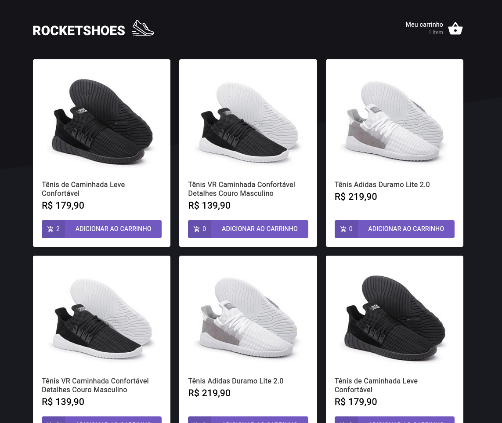
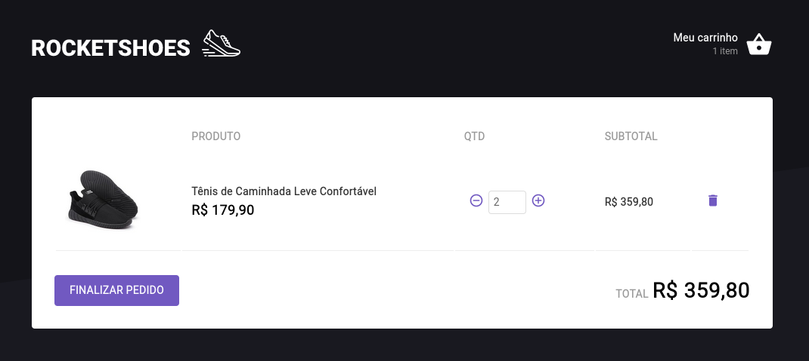

# Shopping Cart ReactJS

Shopping cart developed in challenge 02 of the rocketseat ignite course.

## Screenshots

<div align="center" id="top"> 
  
</div>
<br/>
<br/>
<div align="center" id="top"> 
  
</div>
<br/>
<br/>

```bash
# Clone this project
$ https://github.com/ewertonspezia/ShoppingCartReactJS

# Access
$ cd ShoppingCartReactJS

# Install dependencies
$ yarn

# Run the project
$ yarn server
$ yarn start

# The server will initialize in the <http://localhost:3000>
```
